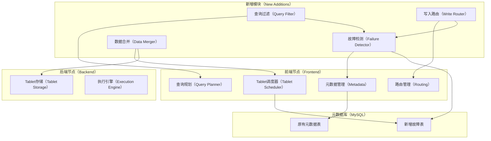
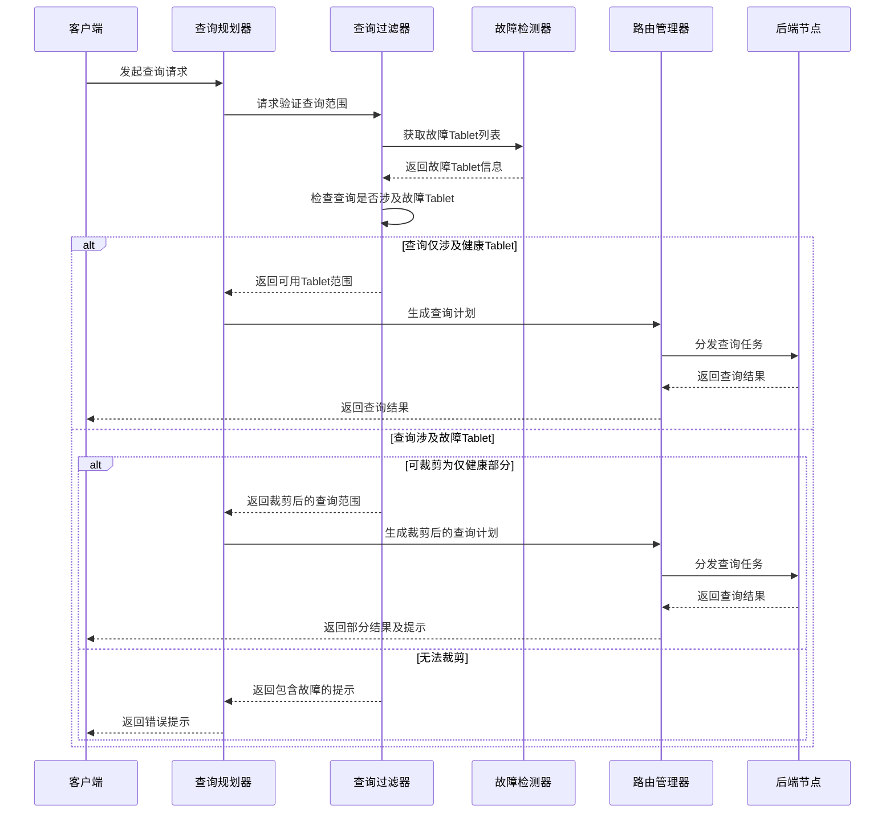
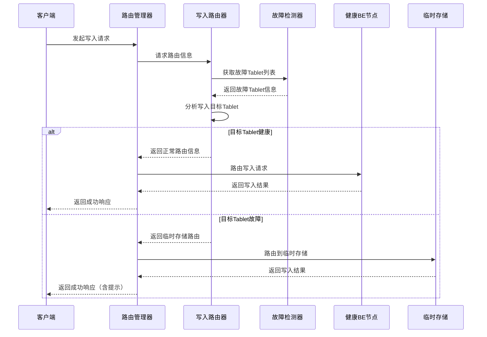
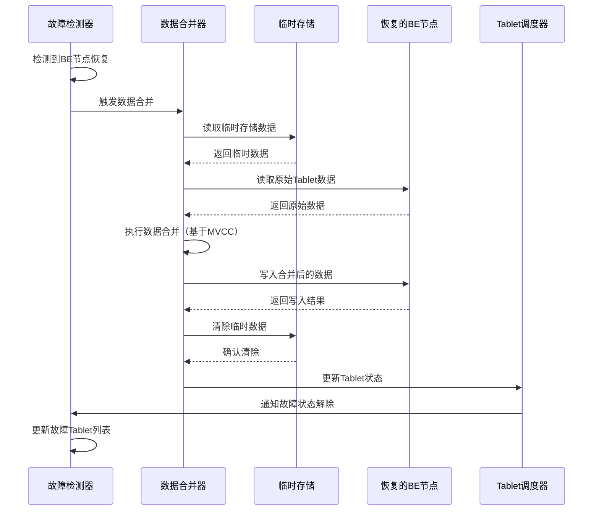
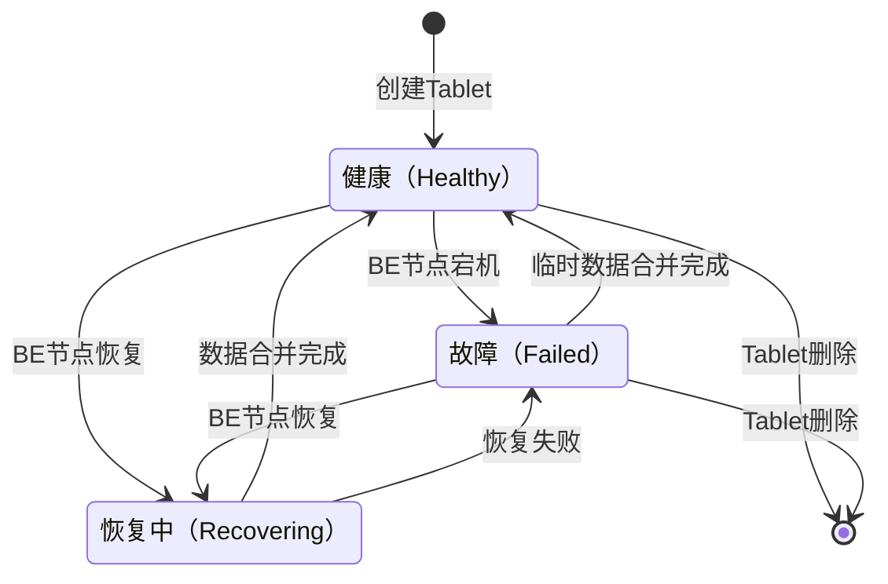
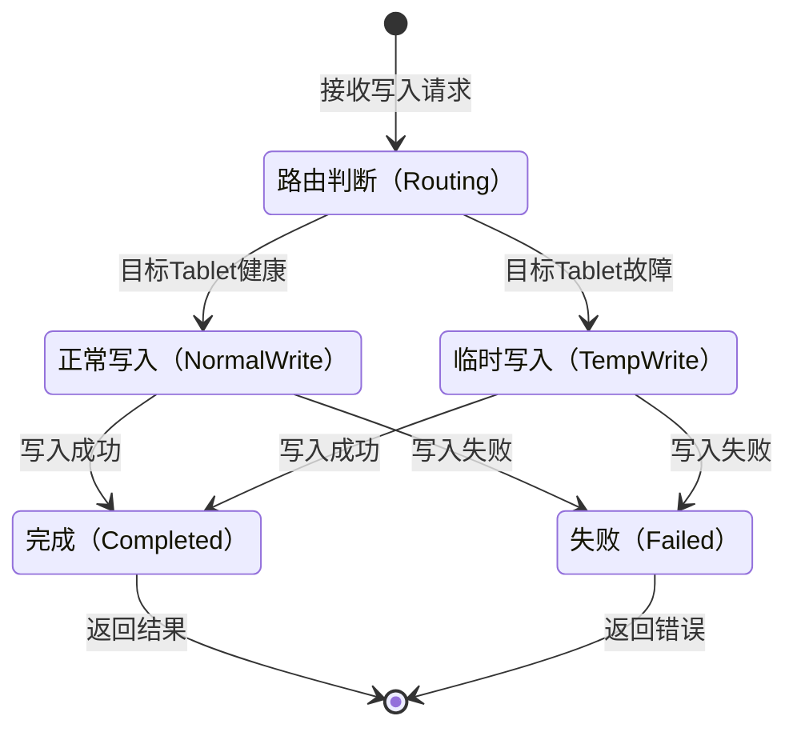

# StarRocks单副本部署下的"部分可用"方案设计

**计划推向社区**

## 问题澄清

在StarRocks单副本（num_replicas=1）部署场景中，核心挑战在于单点故障的影响范围过大。当一个BE节点宕机时，其上所有Tablet均不可用，而StarRocks的"全或无"机制会导致涉及这些Tablet的整个查询或写入操作失败。本方案旨在实现"部分可用"的可靠机制，允许业务系统在单BE故障时继续处理不涉及故障Tablet的请求，同时保证数据的一致性和可恢复性。

这一需求本质上是在资源受限无法部署多副本的场景下，通过牺牲数据完整性来换取服务连续性的降级可用策略，确保系统在部分节点故障时仍能提供有限但关键的服务能力。

这是对StarRocks全面场景的关键特性补充。

## 方案评估与优化建议

### 替代方案分析

1. **多副本部署策略**
   这是StarRocks推荐的标准高可用方案，通过将`num_replicas`设置为3（默认值），可避免单点故障导致的数据不可用。StarRocks原生支持副本管理和自动修复机制，当检测到副本异常时，会通过增量或全量克隆进行修复[1]。该方案无需额外开发，但会增加存储和网络开销。

2. **表分区优化策略**
   通过合理的分区设计（如按时间或业务维度），将大表拆分为多个分区，使每个分区尽量分布在不同BE节点。这种情况下，单点故障仅影响部分分区，而非整个表[2]。该方案利用现有功能，无需修改StarRocks内核，但依赖于合理的表设计。

3. **混合存储方案**
   结合外部存储（如S3、HDFS）实现数据备份，在故障时可快速恢复丢失的Tablet数据。该方案实现简单，但恢复速度取决于数据量和网络带宽。

### 本方案的优势

相较于上述方案，本设计的"部分可用"方案具有以下优势：
- 保持单副本部署的资源优势，同时提供基础的故障容忍能力
- 无需业务方修改表结构或部署方式
- 实现故障期间的数据可写性，避免数据丢失
- 提供自动化的数据合并机制，简化故障恢复流程

## 详细设计

### 系统架构

本方案在StarRocks原有架构基础上，新增了四个核心模块，以实现"部分可用"功能，同时最大限度减少对原有代码的侵入。



架构说明：
- **故障检测（FD）**：负责监测BE节点和Tablet的健康状态，维护故障Tablet列表
- **查询过滤（QF）**：在查询规划阶段过滤掉故障Tablet，实现查询范围裁剪
- **写入路由（WR）**：将写入请求路由到正常Tablet，对故障Tablet的数据写入临时存储
- **数据合并（DM）**：在故障恢复后，合并临时存储与原始Tablet的数据

### 组件交互时序

以下时序图展示了查询、写入和恢复三个核心场景的组件交互流程：

#### 查询处理流程



#### 写入处理流程



#### 故障恢复流程



### 状态机设计

#### Tablet状态机



状态说明：
- **健康（Healthy）**：Tablet正常可用，可进行读写操作
- **故障（Failed）**：Tablet所在BE节点宕机，无法访问
- **恢复中（Recovering）**：BE节点已恢复，正在进行数据合并

#### 数据写入状态机



### 核心功能设计

#### 1. 故障Tablet记录机制

利用StarRocks现有的FE元数据存储（MySQL），新增专门的表来记录故障Tablet信息，避免单独设计存储结构。

```sql
-- 新增故障Tablet记录表
CREATE TABLE IF NOT EXISTS tablet_failure (
    tablet_id BIGINT NOT NULL,
    backend_id BIGINT NOT NULL,
    partition_id BIGINT NOT NULL,
    table_id BIGINT NOT NULL,
    fail_time TIMESTAMP NOT NULL,
    recovery_time TIMESTAMP NULL,
    status TINYINT NOT NULL COMMENT '0: 故障, 1: 恢复中, 2: 已恢复',
    temp_table_id BIGINT NULL COMMENT '临时表ID',
    PRIMARY KEY (tablet_id),
    INDEX idx_backend (backend_id),
    INDEX idx_table (table_id)
) ENGINE=OLAP COMMENT '记录故障Tablet信息';
```

故障检测模块通过监控BE节点的心跳状态和Tablet的可用性，实时更新该表。当检测到BE节点宕机时，将该节点上所有Tablet标记为故障状态；当BE节点恢复时，更新状态为恢复中，并在数据合并完成后标记为已恢复。

#### 2. 数据合并策略

采用基于StarRocks现有MVCC（多版本并发控制）机制的数据合并方案：

1. **临时存储设计**：为每个故障Tablet创建对应的临时Tablet，结构与原Tablet一致，用于存储故障期间的写入数据。临时Tablet的元数据信息记录在`tablet_failure`表中。

2. **合并触发时机**：当故障BE节点恢复并重新加入集群后，由数据合并模块自动触发合并流程。

3. **合并流程**：
   - 读取原始Tablet和临时Tablet的所有版本数据
   - 基于时间戳和事务ID进行版本合并，处理冲突
   - 保留最新版本的数据，删除过期版本
   - 将合并结果写入原始Tablet
   - 验证合并结果后，删除临时Tablet

4. **高效合并优化**：
   - 利用StarRocks现有的Compaction机制进行物理文件合并
   - 采用增量合并策略，仅处理故障期间的变更数据
   - 合并过程中不阻塞查询，通过版本控制保证数据一致性

#### 3. 查询过滤实现

在FE的查询分析阶段扩展过滤逻辑，实现Tablet级别的查询裁剪：

1. **查询解析**：在SQL解析后，获取查询涉及的表和分区范围。

2. **故障Tablet匹配**：根据`tablet_failure`表中的记录，确定查询范围内的故障Tablet。

3. **查询范围判断**：
   - 若查询完全不涉及故障Tablet，正常执行
   - 若查询部分涉及故障Tablet，且可裁剪为仅健康部分，则自动调整查询范围
   - 若查询核心数据涉及故障Tablet且无法裁剪，则返回友好提示

4. **执行计划调整**：修改查询执行计划，跳过故障Tablet，仅在健康Tablet上执行查询。

#### 4. 写入路由机制

确保写入请求正确路由到正常Tablet或临时存储：

1. **路由判断**：根据写入数据的分区键和分桶键，计算目标Tablet，并检查其健康状态。

2. **正常路由**：若目标Tablet健康，按原有逻辑路由到对应BE节点。

3. **临时路由**：若目标Tablet故障，路由到临时Tablet：
   - 若临时Tablet不存在，则自动创建
   - 将数据写入临时Tablet
   - 记录数据的版本信息，用于后续合并

4. **原子性保证**：确保写入操作的原子性，无论是写入正常Tablet还是临时Tablet，都通过事务机制保证数据一致性。

#### 5. 代码隔离策略

为最小化对StarRocks原有代码的改动，采用以下隔离策略：

1. **插件化设计**：核心功能通过插件方式实现，与原有代码解耦。

2. **新增目录结构**：在`fe/fe-core/src/main/java/com/starrocks/partial`目录下实现所有模块：
   - `failure`：故障检测与记录
   - `query`：查询过滤逻辑
   - `write`：写入路由管理
   - `merge`：数据合并功能

3. **钩子（Hook）机制**：通过钩子方式接入入原有流程，如查询规划、写入路由等，避免直接修改原有核心代码。

4. **配置开关**：新增配置项`partial_available_enabled`，用于开启/关闭该功能，方便灰度和回滚。

## 参考资料

[1] StarRocks 官方文档, "管理副本", https://docs.starrocks.io/zh/docs/administration/management/resource_management/replica/

[2] StarRocks 官方文档, "数据分布", https://docs.starrocks.io/zh/docs/table_design/data_distribution/

[3] StarRocks 官方文档, "分区最佳实践", https://docs.starrocks.io/zh/docs/best_practices/partitioning/

[4] StarAvail 一个高性能代理服务，专为 StarRocks 单副本部署提供部分可用性保障，并优化数据摄入管道, https://github.com/turtacn/staravail
